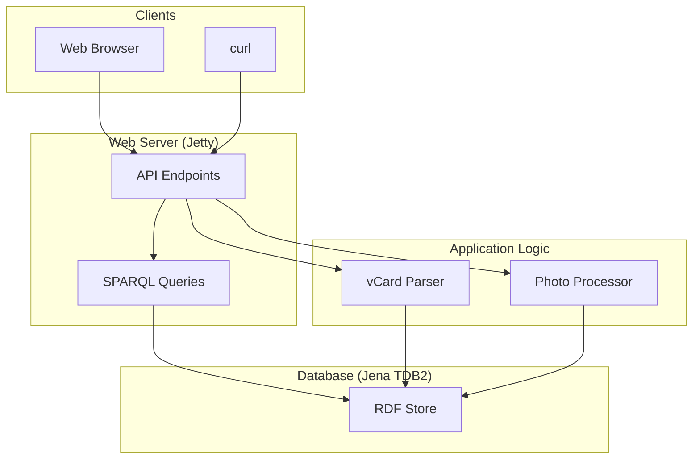
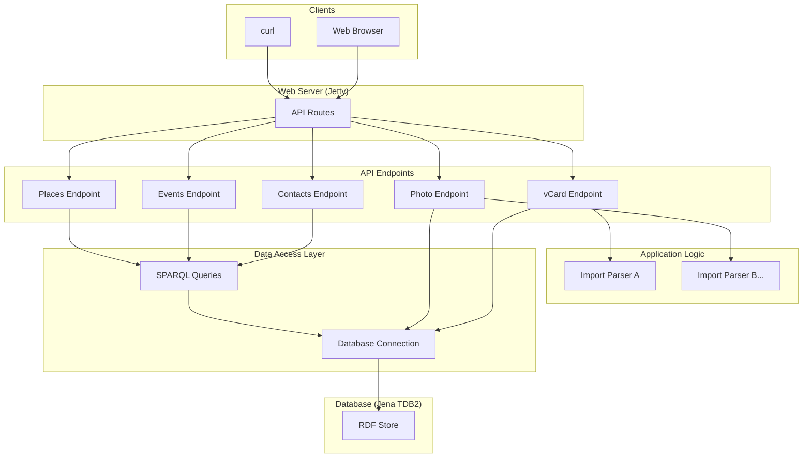

# Architecture

This document describes the architecture of the Redweed application.

## Overview

Redweed is a personal information management system that uses an RDF database to store data. The application is built with [Micronaut](https://micronaut.io/), which is configured to use the Jetty web server, and uses the [Jena TDB2](https://jena.apache.org/documentation/tdb/) database for RDF storage. The application is exposed as a web service with a JSON API.

This project contains the code for interacting with the redweed data store.

- seed with sample data
- add data from a variety of input formats
- query data for RDF
- query to return data in a variety of output formats

## Key Components

The application is composed of the following key components:

*   **Web Server:** The web server is implemented using Jetty. It exposes a JSON API for interacting with the application.
*   **RDF Database:** The RDF database is implemented using Jena TDB2. It stores all of the application's data.
*   **vCard Parser:** The vCard parser is responsible for parsing vCard files and converting them to RDF.
*   **Photo Processor:** The photo processor is responsible for processing photo uploads, extracting EXIF metadata, and storing it as RDF.
*   **Seed Scripts:** The seed scripts are used to populate the database with sample data.

## Interactions

The following diagram shows the interactions between the key components of the application:

## Planned Improvements

The following improvements are planned for the architecture of the application. The goal is to ensure the maintainability, readability, and extensibility of the application.

*   **Separate SPARQL queries from the server logic.**
*   **Use a modular approach to building the API.**
*   **Introduce a data access layer.** A data access layer abstracts the database from the rest of the application.

The following diagram shows the improved architecture:

