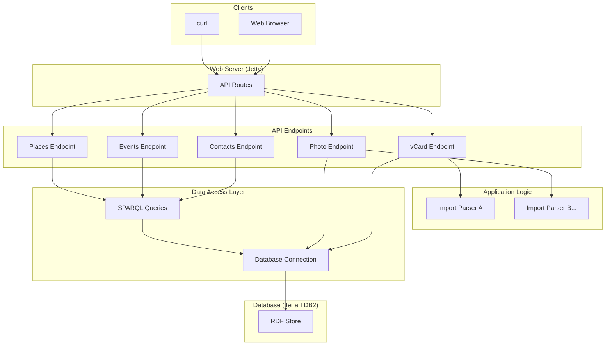

# Planned architecture

This document proposes an architecture of the Redweed application. The goal is to ensure the maintainability, readability, and extensibility of the application.

## Proposals

*   **Separate SPARQL queries from the server logic.** 
*   **Use a modular approach to building the API.**
*   **Introduce a data access layer.**  A data access layer abstracts the database from the rest of the application.

## Improved Architecture

The following diagram shows the improved architecture:

