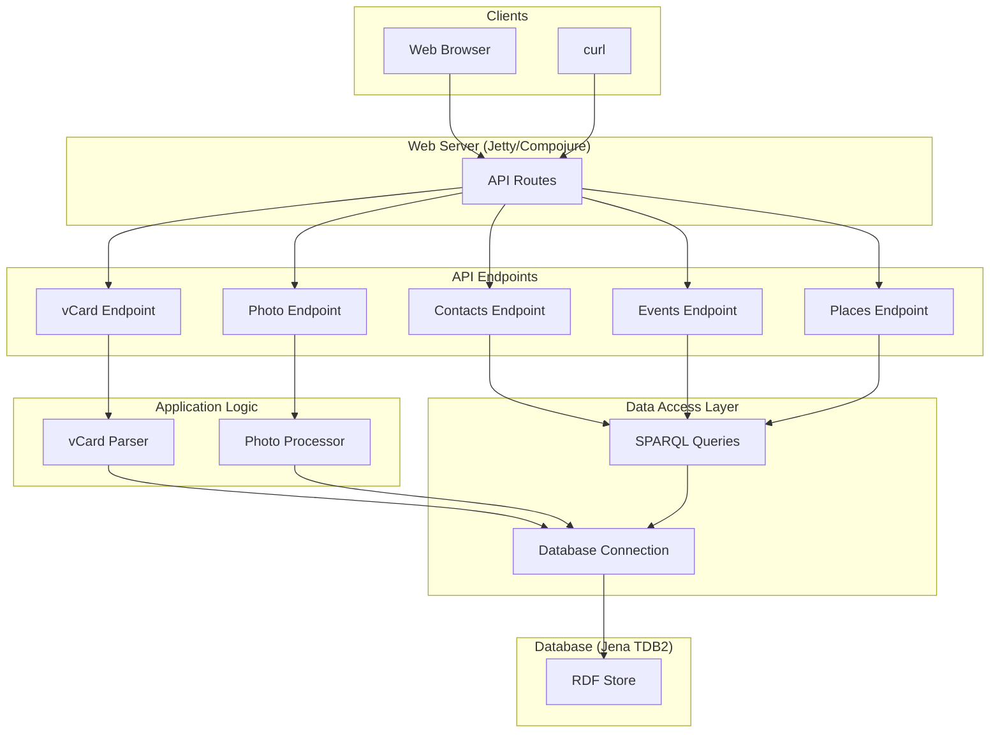

# Architectural Improvements

This document proposes some improvements to the architecture of the Redweed application. The goal of these improvements is to improve the maintainability, readability, and extensibility of the application.

## Proposed Improvements

The following improvements are proposed:

*   **Separate SPARQL queries from the server logic.** The SPARQL queries are currently embedded in the `rwclj.server` namespace. This makes the code harder to read and maintain. The queries should be moved to their own namespace.
*   **Create a dedicated namespace for each API endpoint.** The `rwclj.server` namespace currently handles all of the API endpoints. This makes the namespace large and difficult to navigate. Each endpoint should be moved to its own namespace.
*   **Use a more modular approach to building the API.** The API is currently built using a single `defroutes` form. This makes it difficult to add or remove endpoints. A more modular approach would be to define each endpoint as a separate function and then combine them into a single handler.
*   **Introduce a data access layer.** The application currently queries the database directly from the server namespace. This makes it difficult to change the database implementation in the future. A data access layer would abstract the database from the rest of the application.

## Improved Architecture

The following diagram shows the improved architecture:

## Benefits of the Improved Architecture

The improved architecture would have the following benefits:

*   **Improved maintainability:** The code would be easier to maintain because it would be more modular and better organized.
*   **Improved readability:** The code would be easier to read because it would be split into smaller, more focused namespaces.
*   **Improved extensibility:** The application would be easier to extend because new features could be added without modifying the existing code.
