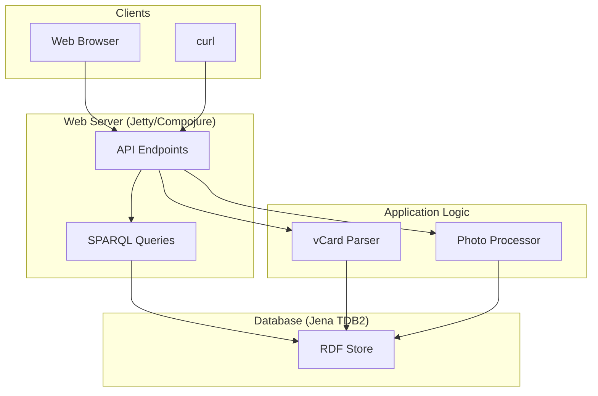

# Architecture

This document describes the architecture of the Redweed application.

## Overview

Redweed is a personal information management system that uses an RDF database to store data. The application is built in Clojure and uses the Jena TDB2 database for RDF storage. The application is exposed as a web service with a JSON API.

## Key Components

The application is composed of the following key components:

*   **Web Server:** The web server is implemented using Jetty and Compojure. It exposes a JSON API for interacting with the application.
*   **RDF Database:** The RDF database is implemented using Jena TDB2. It stores all of the application's data.
*   **vCard Parser:** The vCard parser is responsible for parsing vCard files and converting them to RDF.
*   **Photo Processor:** The photo processor is responsible for processing photo uploads, extracting EXIF metadata, and storing it as RDF.
*   **Seed Scripts:** The seed scripts are used to populate the database with sample data.

## Interactions

The following diagram shows the interactions between the key components of the application:

## Data Model

The application uses the following RDF vocabularies to represent data:

*   **FOAF (Friend of a Friend):** Used to describe people and their relationships.
*   **vCard:** Used to represent contact information.
*   **Dublin Core:** Used for photo metadata.
*   **Event Ontology:** Used to describe events.
*   **Geo Vocab:** Used to describe places.
*   **Schema.org:** Used for various things, including mountains and exercise actions.

## API

The application exposes a JSON API with the following endpoints:

*   `/health`: Health check.
*   `/api/vcard/import`: Import a vCard.
*   `/api/photo/upload`: Upload a photo.
*   `/contacts`: List all contacts.
*   `/contacts/:name`: Get a contact by name.
*   `/events`: List events in a date range.
*   `/places`: List all places.
